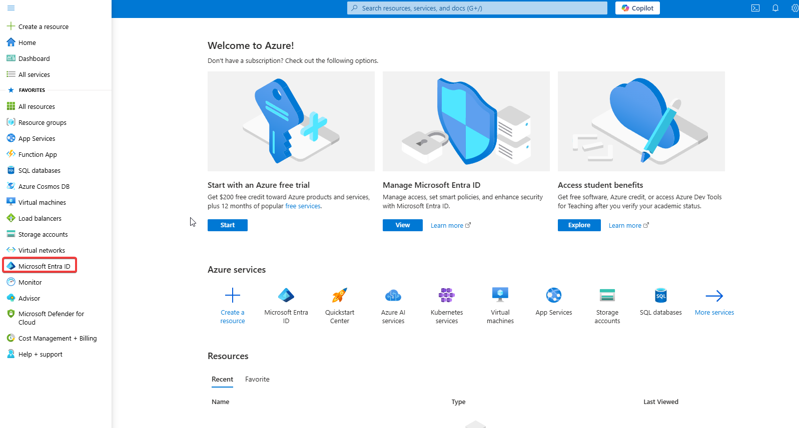
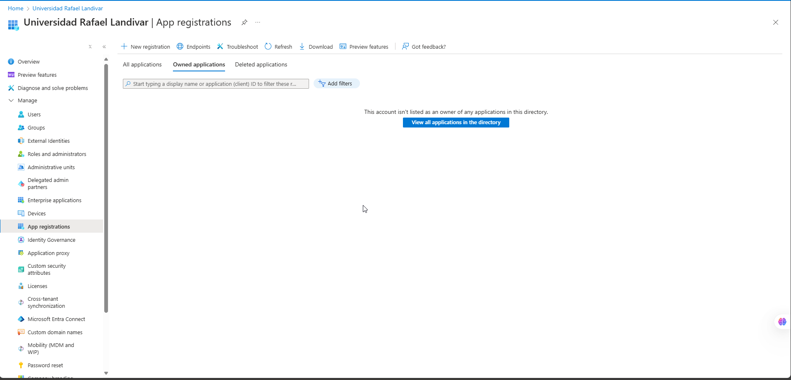
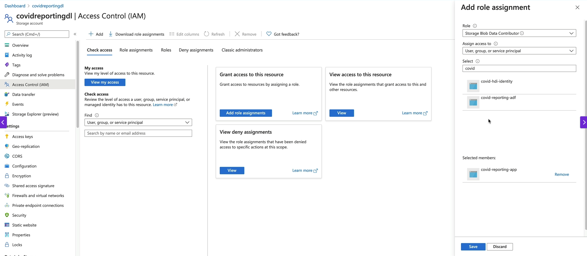

# Data source:

[Covid data](https://www.ecdc.europa.eu/en/covid-19/data)

## Working with Data Flows:

### The select activity:

1. Here you can select all the columns that you want from the previous activity.
2. You have access to different types of column mapping, for example:
   - By default, the Data Flow maps every input to an output
   - It has an auto mapping option, if enabled, if you have any drifted columns, the activity will also flow them through
   - There is a rule based mapping in which you can specify an expression and then you can evaluate and have separate fields based on that.
   - With the rule based mapping you can rename all column names:
     ```scala
     'your_prefix' + $$ #The dollars represent all columns
     ```
3. There are two options available:
   - Skip duplicate input columns: If you have a duplicate column it will only take the first one and then it'll ignore the next ones. This could happen if for example you had a join or lookup activity before the select.
   - Skip duplicate output columns: If you have two output columns with the same name, it will only take the top one.

### The Lookup activity:

It works very similar to a left outer join in a join activity. You have to select a primary stream and a Lookup stream, the match columns and it's Lookup conditions.

This will append all the columns from the Lookup stream onto the primary stream. If your lookup stream has multiple rows that will match with the primary stream you can specify if you want to keep all matches, create a match with any row or only with the first or last row.

It has an "Optimize" section in which you can Broadcast the data. As mentioned, everything we do on a data flow runs on a spark cluster. Spark works on a distributed computing infrastructure. If we set an Auto or Fixed broadcast it will push all of the data into every single spark node. Therefore, we have to make sure that the nodes have got enough memory so they can fit the lookup data (stream) entirely and get best performance outta them.

## HDInsight & Databricks

## Prepare Data for HDInsight

The Data Flows from Azure Data Factory execute in Spark which works on distributed computing similar to HDInsight. In this section we will be learning about the HDInsight activity from ADF rather than learn about HDInsight or Hadoop as a whole

In order to work with those technologies we need to have our data written to folders as opposed to files. In HDInsight, every table points to a folder as opposed to a file.

In order to use this activity, we need to crate an HDInsight Cluster. These clusters are build even when they're not being used.

#### Create a HDInsight Cluster via the Azure Portal

Before we can create it, we will need to create a resource called managed identity. The cluster needs to be able to access the blob storage account, HDInsight only allows access to Data Lake Storage Gen2 accounts via a managed identity. The managed identity is a feature of Azure Active Directory that lets you assign an identity to various Azure resources without the need for an identity's credential. We can then provide access to the Azure resources via the managed identity.

The HDInsight cluster is created as a service (it's not inside ADF). The region for the HDInsight cluster has to be the same as the region for the Data Lake Storage Gen2.

When creating a HDInsight cluster you have to select the cluster type, depending on the type of cluster you selected, you will be asked to pick bigger nodes which will translate in you spending more money. These clusters are charged as soon as they are created and stops when the cluster is deleted.

HDInsight uses Ambary for the full management of our cluster. There you can look at every node, check for:

- Activities going on
- Add new metrics to a cluster dashboard
- Look at all the nodes from the cluster
- Check for background operations
- Stop/restart/start services
- Query Hive tables (you can also use different softwares to interact with the Hive tables, HDInsights supports JDBC connections)

### Explaining the Hive Script

[Script File](covid_transform_testing.hql)

1. We create the databases needed if they don't exist
2. We create the external tables (syntax similar to Synapse). Since they are external tables, they are not managed by Hive, but they are just a structure which is placed on top of the sources. The source of the data will be the folders from the Data Lake. They are just logical tables, therefore, if you drop the table, the data is not actually dropped.
3. We create the managed tables. With these type of tables, the data would get dropped if we drop the table.
4. Ingest the table with the data from select statement
5. Create the pipeline to execute the hql Script. Inside ADF there are multiple activities related to HDInsight which (by the time) are:
   - Hive
   - MapReduce
   - Pig
   - Spark
   - Streaming
6. Within the activity in ADF, you can create a link service to either use your own HDInsight cluster, or an On-demand cluster (will create a cluster and destroy it when it's done processing).

## Working with Databricks

1. Create a Databricks service: You can create it using the Azure portal. Once created there are not many configurations that can be applied within Azure portal since most of it is contained inside Databricks

2. Create a Databricks cluster: A cluster is a set of computation resources and configurations on which you can run your workload. They usually have one driver node and one or more worker nodes. On very node we will have Virtual Machine (VM) images with pre-install libraries that we can specify while we are creating the cluster. The driver node plus all the worker nodes are known as the Databricks Runtime. These are the two types of clusters in Databricks:

   - All purpose/Interactive clusters: Analyze the data interactively using notebooks and collaborate with other team members. They are manually created and you can manually create and restart them.
   - Job Clusters: They are created by the Databricks Job Scheduler when we run a Job. They are automatically terminated at the end of the execution.

3. Mount a Storage Account:

   - Create an Azure Service Principal: At the Portal we can look for it typing "Microsoft Entra ID".
     
     Once there, look for "App registrations" to create a new registration for service principal.
     
   - Grant access for the Data Lake to Azure Service Principal: When you have created the new Registration, you need to store thee things which are: Tenant ID, Application ID and you will need to create a new secret in order to connect. Once you have done that, you need to go to the storage account and enter the IAM control panel. There you will need to create the role in order to connect the storage account with your Service Principal.
     
   - Mount the Storage Account in Databricks via the Service Principal: This step will be done on the Databricks Workspace. There is a python script that contain all the necessary steps to Mount the Storage Account [you can look at it here](mount_storage.py). Inside that script you will need the Client ID, Tenant ID and the Secret that you created when adding the new register (Service Principal). Keep in mind that for the Secret you would normally need to use The Key Vault.

4. Create your transformations script: In the python script you will need to replace the storage account name with the one you created. [Click here to look at the script](transform_population_data.py)

5. Create a Pipeline: In order to use the Activity you will need a new Linked Service to connect with your Databricks Workspace. When creating the Linked Service, you will have the option to use an Existing interactive cluster, create a Job Cluster or use an Existing Instance Pool.

## Getting ready for a production environment

### Working with triggers

When working with triggers you can add dependencies between different triggers using the advanced settings from the the trigger that will have dependencies.

The triggers with dependencies will start but they will be waiting for the completion of the dependency trigger. For the dependencies you can specify the OFFSET (from what datetime we want the data) and the WINDOW SIZE (how much time)

[Documentation](https://learn.microsoft.com/en-us/azure/data-factory/tumbling-window-trigger-dependency)

## Monitoring

### What to monitor

- Azure Data Factory Resource
- Integration runtime (CPU utilization, available memory)
- Trigger runs
- Pipeline runs
- Activity runs

#### Data Factory Monitor

ADF has it's own monitor capabilities. It can monitor the status of pipelines/triggers. It can be used to re-run failed pipelines/triggers and with it you can also send alerts from base level metrics. All the pipeline runs are stored only for 45 days. It only allow us to monitor a single ADF (since it runs within the ADF resource)

#### Azure Monitor

It provides:

- Route the diagnostic data to other storage solutions
- Richer diagnostic data
- Write complex queries and custom reporting
- Report across multiple data factories

You can track specific metrics, create custom alerts, send notifications and create dashboards to better understand the Azure Data Factory metrics.

#### Re-Run Failed Pipelines

When working with ADF at the monitor section we can take a look at all the Pipeline and Triggers runs. If a pipeline failed we have two options which are:

- Re-run the complete pipeline
- Re-run the pipeline starting from the failed activity.

When you re-run a trigger it will restart the complete pipeline's execution.

#### Azure Monitor and ADF

When working with Azure monitor, you can select an storage to keep all your diagnostics data. In order to do so yo need to:

1. Enter Azure Monitor
2. Enter to Diagnostic settings
3. Select a resource
4. Click on "Add diagnostic setting"
5. Select the logs and metrics that you want to store
6. Choose a destination (Analytics workspace, Archive or storage account, stream to an Event Hub)
7. When working with an storage account you can set a Retention policy in days. If you leave it as Zero, the data will be stored forever. This process will create a container for each metric you selected.

## Log Analytics

1. First you have to create a Log Analytics Workspace resource on the Azure Portal.
2. Within your ADF go to Diagnostic settings
3. Click on "Add diagnostic setting"
4. Select the logs and metrics that you want to store
5. Choose as destination the Log Analytics Workspace and select the resource you just created
6. When selecting this destination, you will have two options>
   - Azure diagnostics: Puts all the logs into one table
   - Resource specific: Separate tables for each of the metrics and each of the logs.

In order to query the data you will need to use Kusto Query Language (KQL).

[Kusto query Language documentation](https://learn.microsoft.com/en-us/kusto/query/kql-quick-reference?view=azure-data-explorer&preserve-view=true)
