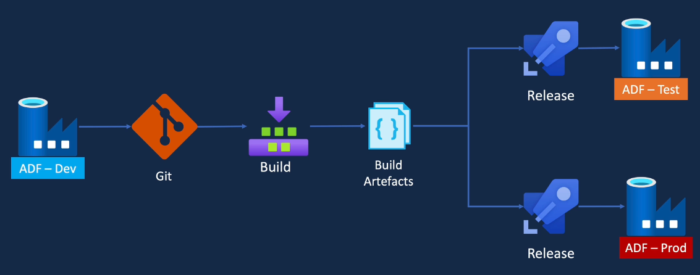
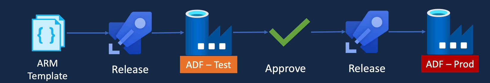
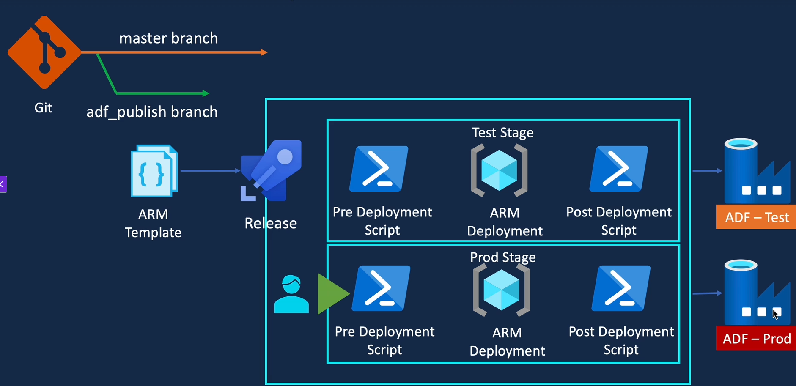
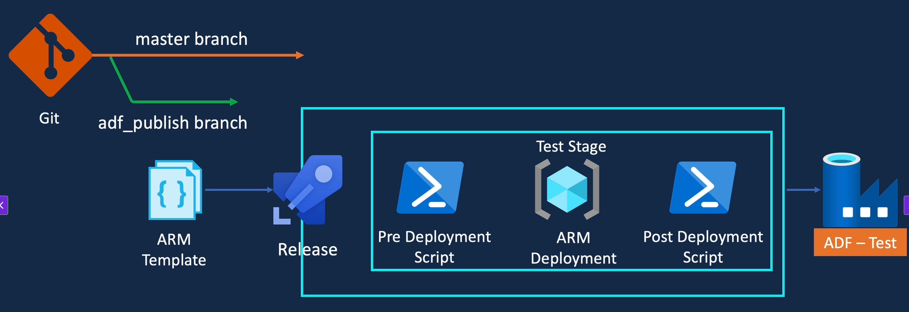
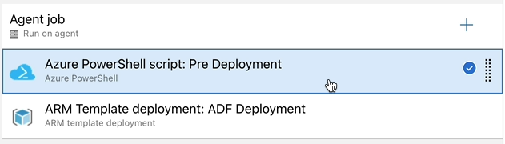
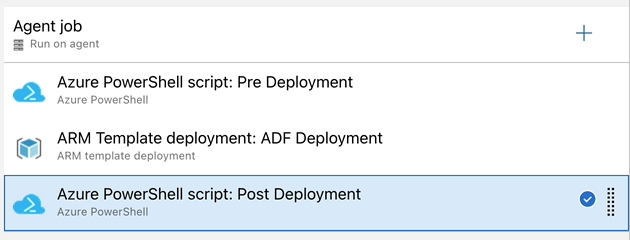
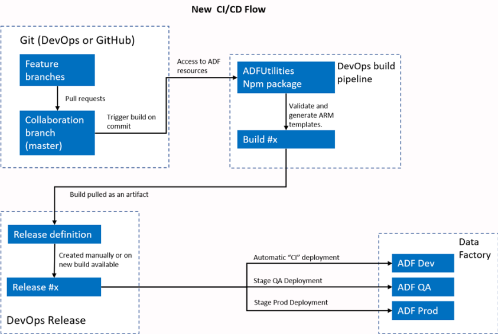
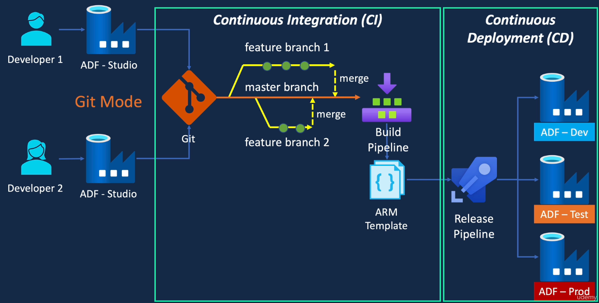

# Data source:

[Covid data](https://www.ecdc.europa.eu/en/covid-19/data)

## Working with Data Flows:

### The select activity:

1. Here you can select all the columns that you want from the previous activity.
2. You have access to different types of column mapping, for example:
   - By default, the Data Flow maps every input to an output
   - It has an auto mapping option, if enabled, if you have any drifted columns, the activity will also flow them through
   - There is a rule based mapping in which you can specify an expression and then you can evaluate and have separate fields based on that.
   - With the rule based mapping you can rename all column names:
     ```scala
     'your_prefix' + $$ #The dollars represent all columns
     ```
3. There are two options available:
   - Skip duplicate input columns: If you have a duplicate column it will only take the first one and then it'll ignore the next ones. This could happen if for example you had a join or lookup activity before the select.
   - Skip duplicate output columns: If you have two output columns with the same name, it will only take the top one.

### The Lookup activity:

It works very similar to a left outer join in a join activity. You have to select a primary stream and a Lookup stream, the match columns and it's Lookup conditions.

This will append all the columns from the Lookup stream onto the primary stream. If your lookup stream has multiple rows that will match with the primary stream you can specify if you want to keep all matches, create a match with any row or only with the first or last row.

It has an "Optimize" section in which you can Broadcast the data. As mentioned, everything we do on a data flow runs on a spark cluster. Spark works on a distributed computing infrastructure. If we set an Auto or Fixed broadcast it will push all of the data into every single spark node. Therefore, we have to make sure that the nodes have got enough memory so they can fit the lookup data (stream) entirely and get best performance outta them.

## HDInsight & Databricks

## Prepare Data for HDInsight

The Data Flows from Azure Data Factory execute in Spark which works on distributed computing similar to HDInsight. In this section we will be learning about the HDInsight activity from ADF rather than learn about HDInsight or Hadoop as a whole

In order to work with those technologies we need to have our data written to folders as opposed to files. In HDInsight, every table points to a folder as opposed to a file.

In order to use this activity, we need to crate an HDInsight Cluster. These clusters are build even when they're not being used.

#### Create a HDInsight Cluster via the Azure Portal

Before we can create it, we will need to create a resource called managed identity. The cluster needs to be able to access the blob storage account, HDInsight only allows access to Data Lake Storage Gen2 accounts via a managed identity. The managed identity is a feature of Azure Active Directory that lets you assign an identity to various Azure resources without the need for an identity's credential. We can then provide access to the Azure resources via the managed identity.

The HDInsight cluster is created as a service (it's not inside ADF). The region for the HDInsight cluster has to be the same as the region for the Data Lake Storage Gen2.

When creating a HDInsight cluster you have to select the cluster type, depending on the type of cluster you selected, you will be asked to pick bigger nodes which will translate in you spending more money. These clusters are charged as soon as they are created and stops when the cluster is deleted.

HDInsight uses Ambary for the full management of our cluster. There you can look at every node, check for:

- Activities going on
- Add new metrics to a cluster dashboard
- Look at all the nodes from the cluster
- Check for background operations
- Stop/restart/start services
- Query Hive tables (you can also use different softwares to interact with the Hive tables, HDInsights supports JDBC connections)

### Explaining the Hive Script

[Script File](covid_transform_testing.hql)

1. We create the databases needed if they don't exist
2. We create the external tables (syntax similar to Synapse). Since they are external tables, they are not managed by Hive, but they are just a structure which is placed on top of the sources. The source of the data will be the folders from the Data Lake. They are just logical tables, therefore, if you drop the table, the data is not actually dropped.
3. We create the managed tables. With these type of tables, the data would get dropped if we drop the table.
4. Ingest the table with the data from select statement
5. Create the pipeline to execute the hql Script. Inside ADF there are multiple activities related to HDInsight which (by the time) are:
   - Hive
   - MapReduce
   - Pig
   - Spark
   - Streaming
6. Within the activity in ADF, you can create a link service to either use your own HDInsight cluster, or an On-demand cluster (will create a cluster and destroy it when it's done processing).

## Working with Databricks

1. Create a Databricks service: You can create it using the Azure portal. Once created there are not many configurations that can be applied within Azure portal since most of it is contained inside Databricks

2. Create a Databricks cluster: A cluster is a set of computation resources and configurations on which you can run your workload. They usually have one driver node and one or more worker nodes. On very node we will have Virtual Machine (VM) images with pre-install libraries that we can specify while we are creating the cluster. The driver node plus all the worker nodes are known as the Databricks Runtime. These are the two types of clusters in Databricks:

   - All purpose/Interactive clusters: Analyze the data interactively using notebooks and collaborate with other team members. They are manually created and you can manually create and restart them.
   - Job Clusters: They are created by the Databricks Job Scheduler when we run a Job. They are automatically terminated at the end of the execution.

3. Mount a Storage Account:

   - Create an Azure Service Principal: At the Portal we can look for it typing "Microsoft Entra ID".
     
     Once there, look for "App registrations" to create a new registration for service principal.
     
   - Grant access for the Data Lake to Azure Service Principal: When you have created the new Registration, you need to store thee things which are: Tenant ID, Application ID and you will need to create a new secret in order to connect. Once you have done that, you need to go to the storage account and enter the IAM control panel. There you will need to create the role in order to connect the storage account with your Service Principal.
     
   - Mount the Storage Account in Databricks via the Service Principal: This step will be done on the Databricks Workspace. There is a python script that contain all the necessary steps to Mount the Storage Account [you can look at it here](mount_storage.py). Inside that script you will need the Client ID, Tenant ID and the Secret that you created when adding the new register (Service Principal). Keep in mind that for the Secret you would normally need to use The Key Vault.

4. Create your transformations script: In the python script you will need to replace the storage account name with the one you created. [Click here to look at the script](transform_population_data.py)

5. Create a Pipeline: In order to use the Activity you will need a new Linked Service to connect with your Databricks Workspace. When creating the Linked Service, you will have the option to use an Existing interactive cluster, create a Job Cluster or use an Existing Instance Pool.

## Getting ready for a production environment

### Working with triggers

When working with triggers you can add dependencies between different triggers using the advanced settings from the the trigger that will have dependencies.

The triggers with dependencies will start but they will be waiting for the completion of the dependency trigger. For the dependencies you can specify the OFFSET (from what datetime we want the data) and the WINDOW SIZE (how much time)

[Documentation](https://learn.microsoft.com/en-us/azure/data-factory/tumbling-window-trigger-dependency)

## Monitoring

### What to monitor

- Azure Data Factory Resource
- Integration runtime (CPU utilization, available memory)
- Trigger runs
- Pipeline runs
- Activity runs

#### Data Factory Monitor

ADF has it's own monitor capabilities. It can monitor the status of pipelines/triggers. It can be used to re-run failed pipelines/triggers and with it you can also send alerts from base level metrics. All the pipeline runs are stored only for 45 days. It only allow us to monitor a single ADF (since it runs within the ADF resource)

#### Azure Monitor

It provides:

- Route the diagnostic data to other storage solutions
- Richer diagnostic data
- Write complex queries and custom reporting
- Report across multiple data factories

You can track specific metrics, create custom alerts, send notifications and create dashboards to better understand the Azure Data Factory metrics.

#### Re-Run Failed Pipelines

When working with ADF at the monitor section we can take a look at all the Pipeline and Triggers runs. If a pipeline failed we have two options which are:

- Re-run the complete pipeline
- Re-run the pipeline starting from the failed activity.

When you re-run a trigger it will restart the complete pipeline's execution.

#### Azure Monitor and ADF

When working with Azure monitor, you can select an storage to keep all your diagnostics data. In order to do so yo need to:

1. Enter Azure Monitor
2. Enter to Diagnostic settings
3. Select a resource
4. Click on "Add diagnostic setting"
5. Select the logs and metrics that you want to store
6. Choose a destination (Analytics workspace, Archive or storage account, stream to an Event Hub)
7. When working with an storage account you can set a Retention policy in days. If you leave it as Zero, the data will be stored forever. This process will create a container for each metric you selected.

## Log Analytics

1. First you have to create a Log Analytics Workspace resource on the Azure Portal.
2. Within your ADF go to Diagnostic settings
3. Click on "Add diagnostic setting"
4. Select the logs and metrics that you want to store
5. Choose as destination the Log Analytics Workspace and select the resource you just created
6. When selecting this destination, you will have two options>
   - Azure diagnostics: Puts all the logs into one table
   - Resource specific: Separate tables for each of the metrics and each of the logs.

In order to query the data you will need to use Kusto Query Language (KQL).

[Kusto query Language documentation](https://learn.microsoft.com/en-us/kusto/query/kql-quick-reference?view=azure-data-explorer&preserve-view=true)

## Working with Power BI reports

Power BI is only available for Windows OS.

When working with Power BI you can create several views from many different sources. You can load several data sources at the time and use the fields of each table/data_source. You can also inspect data and create data models.

Power BI will be useful to both data analytics and log analytics. You can connect to external sources by providing access keys or credentials.

## Continuous Integration & Continuous Deployment/Delivery (CI/CD)

In this section we will look at how to configure git with Azure Data Factory. We will also look at the build and release pipeline to enable CI/CD features of the data factory code.



### What is DevOps

It's a DevOps practice to achieve faster time to market as well as increased confidence in delivering software applications.

DevOps it's typically seen as two separate teams/areas Development(Dev) and operations(Ops). The development team is responsible for writing code and testing it. Operations team are responsible for deploying and supporting the code in production. Each team had it's own issues such as communication issues between teams, conflict of interest due to their own team's priorities, lack of automation. As a result, companies couldn't bring products to market as quickly as they wanted to and also, when delivered, the quality of the product wasn't as expected.

In order to solve those issues, companies wanted to join the Development and Operations teams together. The intersection between these two teams is called DevOps. DevOps looks forward to increase the speed and quality of the software development and delivery. CI/CD helps to bring together the development, the deployment of the application and removes the issues faced by the siloed teams. It also increases the time to market speed and the quality of the software being delivered. It's also related to automation not only for the integration and deployment of the code, but also automated testing and monitoring.

### What is CI/CD

When you have an idea for a software application you go through the following steps (as a cycle):

1. Planning: Gather requirements, create user stories, breakdown tasks and plan a sprint
2. Coding: By development team
3. Build: The code gets built
4. Test: Testing the code we just built
5. Release: A new tested version of the code
6. Deployment: To each environment
7. Monitor: The application
8. Improvement: For quality

When we are talking about Continuous Integration we are referring to the steps 2 to 4. While developing applications, must of the time, there will be more than one developer working at the time. Therefore, we need to continuously integrate the code to a source control system. Build is taken to every code merged, also everything that was merged has to pass automated testing.

When we are talking about Continuous Deployment/Delivery, we are talking about releasing and deploying the tested code. Some companies tend to continuously deploy to production, some others tend to have a quality gate or an approval process (manual steps).

### CI/CD in Azure Data Factory

- Behind the scenes every object in ADF can be represented by a JSON file, so that's the code.
- When you build an ADF project, you get an Azure Resource Manager (ARM) template. ARM is Microsoft's deployment and management service for Azure. The ARM template contains the configuration of a project in JSON format, therefore, we can use it to deploy our project to other environments.
- It's not easy to automate testing for integration tools such as ADF. So many projects tend to rely on manual testing
- We release and deploy the ARM template to the higher environments such as test and production.

The practice of CI/CD for ADF components has been evolving over time. At the beginning, Microsoft's recommendation was to do a manual build (using the publish button) and have an automated deployment using release pipelines. The bast majority of the projects are still following this solution, but Microsoft has released a package to do an automated build which could be used in a DevOps built pipeline (fully automated).

Going deeper with the two processes:

1. Using ADF Publish: The dev used ADF studio to create the necessary data factory objects (pipelines, datasets, triggers, etc.). He then debugged the pipelines. Once he was happy with the changes he clicked on the Publish button which carried out the validation of the objects and if there were no errors, it then stored the objects to the ADF repository.

**Key points:**

- We directly connected ADF Studio to the ADF repository
- We made all the changes on the ADF repository
- This way of connecting to the ADF repository is referred to as "Live Mode"
- When working with more than one dev there is a high risk of overlapping pipelines, due to not having a version control
- Lack of a version control so we cannot roll back changes or perform reviews

2. With git mode: It's likely that we will have more than one dev so we need to have a solution where the devs can collaborate. In order to have a version control and have the ability to perform roll backs, reviews and collaborative environments we need to enable a source control solution. We can connect ADF Studio to a source control system (Git or Azure DevOps by the time). When in this mode, developers can create several feature branches and work collaboratively. Once the feature branch is merged to the master branch we can do a publish to the Data Factory. The publish option not only publishes the changes to the ADF dev repository, **but it also creates another branch in git called ADF publish. This branch will contain the ARM templates**

In summary, the publish button is basically performing the build element of our continuous integration. The ARM templates can then be deployed to the higher environments using an Azure DevOps release pipeline as part of the continuous deployment. There is a manual process for the build element of the continuous integration and an automated deployment.

### Getting to know Azure DevOps

Is basically a SaaS offered by Microsoft on the Azure cloud with all the necessary tools to implement a DevOps project from end to end.

**Key services:**

- Boards: Management capability for Agile, Kan-Ban or SCRUM processes. Track progress and generate reports
- Repos: Source control to manage our code. It supports the most popular version of the git as well as Team Foundation Version Control (TFVC)
- Azure Pipelines: Build and release services to support CI/CD
- Test Plans: Browsed based test management solution. It provides all the capabilities for planned manual testing, User Acceptance Testing (UAT) and exploratory testing. Gather feedback from stakeholders and respond to them
- Artifacts: Library service to store packages or development artifacts that can be shared or used within the project.

**How are projects organized within Azure DevOps**

- When you connect to Azure DevOps, you will be connecting to an organization
- An organization is a container for a collection of projects
- Within an organization you can create different projects
- Each project will have its own Boards, Repos, Pipelines, Test Plans and Artifacts
- You can create teams that can work on more than one project

**Getting started**

- Access to dev.azure.com
- Sign In using your Azure account
- **Switch directory to the one that has all the resources that you have created**
- In order to find the right directory you can look for it on the Azure portal at your profile
- Select a Country/Region
- Define an organization name (it has to be a unique name)
- Once in your organization you can create new projects:
  - You have to give a project name
  - Add a description
  - Stablish your project's visibility
  - Select a version control
  - Define a Work Item Process which will be important for our boards.

### Set-up ADF for CI/CD behavior

When working with CI/CD on ADF it's common to have at least two ADF's but you can add one or more test ADF if you need them. It's a best practice to keep these ADF in separate resource groups which are specific for their environments.

They typical structure looks like this:

1. Dev ADF: Will have git enabled so that we can do continuous integration of the code. This code will be deployed by a release pipeline via an ARM template
2. Test ADF: For all the testing required for a production environment. You don't need to enable git in this ADF.
3. Prod ADF: Tested ADF resources and productive code. You don't need to enable git in this ADF.

### ADF Git Configuration

There are many branching strategies to work with Git. The recommendation is to have a main/master branch that will work as the staring point for each feature branch. When finished working on the new feature (from the feature branch) you create a Pull Request (PR) to then merge that feature branch into the main branch. The main branch should be the only one from which we can publish to the ADF repository. ADF also knows this branch as the collaboration branch. Once you publish the code from the main branch, that creates a adf_publish branch that has the ARM template.

#### Steps to enable a Git configuration in ADF

1. Create a Git repository in Azure DevOps. (you can also use ADF to create a Git repository for you)
2. Enable a branch policy for the main branch in order to require a PR in order to commit changes to the collaboration branch (main)
3. Go to ADF and configure git.
4. Enter the ADF Studio
5. Click on the Author icon and select "Set up code repository". You can also access to this configuration via the manage icon and clicking the "Git configuration" from the "Source Control" options.
6. Click Configure
7. Select the repository type (Azure DevOps Git for our scenario)
8. Select the Active Directory that contains your Azure DevOps organization
9. Select your DevOps organization name
10. Select your project name
11. Select the repository name. If you type a repository name that doesn't actually exist within your project, it will be automatically created in Azure DevOps.
12. Select your Collaboration branch (main/master).
13. Define a Publish branch. It will contain the ARM template after each publish from the collaboration branch.
14. You have the option to import any existing resources to the repository. This is useful if you have been using ADF in Live Mode but you wanna bring each resource into Git.
15. Click apply. You will gain connection to the repo but will get an error related to the main branch (it's because of the branch policy).

### ADF Code Development process using Git

1. You have a new feature that requires new resources from ADF
2. Create a feature branch. ADF will treat each of the saves as commits to the Git repository. When you create the new branch from ADF UI, it will be automatically published to Azure DevOps.
3. Start your development process for the new feature. Each time you save your work it will be committed and pushed to Azure DevOps. You can also save specific resources from ADF or click Save All for your commit.
4. Debug your changes.
5. Create a PR if everything it's ok. The PR can be created using either Azure DevOps or in the ADF UI. In the ADF UI you can find this option by clicking on the branch selection dropdown, there you will find the option to create a pull request. It will open up a from within Azure DevOps were you can fill-in the information for your PR.
6. The reviewers approves/rejects the PR.
7. If approved, the feature branch could be merged to the collaboration branch.
8. Complete your PR when it's approved. You will need to select the Merge type and the Post-completion options that you want.
9. Beware that when you complete a PR if you selected the Post-completion option to delete the merged source branch (your feature branch) if you go back to ADF and you are still positioned on that branch, you will get an error when refreshing. You just have to select another existing branch to solve this error.
10. When you checkout main from the ADF UI, you will now see the changes you just merged from your PR.

### Continuous Integration Build - Option 1

The first option is to use the adf_publish branch. These are the steps:

1. Perform all the steps from the development process
2. Once you have merged your feature branch into the collaboration branch you will see the changes from the collaboration branch
3. Publish your collaboration branch. It will publish the changes to the Dev ADF Repository as well as the Git Repository(the ADF instance that has a version control enabled). It will also create the ARM Template.
4. The ARM Template will live in the adf_publish branch
5. If you want to access to the ADF repository before you publish your changes you just have to switch to Live Mode. This option can be found at the branch selection dropdown.
6. Once you have published your changes if you switch to Live Mode you will now see the changes you just published from your source control.
7. On DevOps you will see the new branch (adf_publish) which will contain a folder with the same name as the factory, to content of the folder will be:
   - ARMTemplateForFactory.json: Contains all the information about the Data Factory, for example: The pipeline name, it's activities but also information about policies from the ADF, etc.
   - ARMTemplateParameters.json: Has got the factoryName with the value of your ADF resource. The purpose of this file is that you gain the ability to change the value of the parameter so that you are able to deploy to other environments.

### Continuous Deployment - Option 1

The input for this process is the ARM Template in the adf?publish branch from the build process. We will need a release pipeline that will deploy the ARM Template to the TEST and PRODUCTION ADF's. It's unlikely that you will see a release pipeline which deploys to both test and production ADF'S at the same time, the common scenario is a release pipeline that deploys to a test data factory and only attempts to deploy to production factory after a successful deployment test. The release pipeline would look like this:


After a successful completion of the deployment to the test factory, it sends an approval request for a deployment to production. Once the request has been approve, the release pipeline then deploys the ARM Template to production.

#### Jobs for the release pipeline

1. The staring point will be the ARM Template which needs to be deployed to the test data factory.
2. Azure DevOps provides a Job called ARM deployment. We can simply invoke the job with the required information about the ARM Template and the data factory details. This deployment comes with a couple of issues:
   - The deployment via ARM Template can only add or update artifacts it doesn't delete any components. For example, if you deleted a pipeline, that won't take effect.
   - The deployment fails if we try to update a data factory trigger which is currently active in the destination data factory. In order to solve this you can run a deployment script which will stop the triggers before the deployment and start them once the deployment completes.
3. The script mentioned on point 2 is written in PowerShell, therefore, we need a pre-deployment PowerShell job as well as a post-deployment PowerShell job.
4. We have to deploy to prod, in order to that we can create stages for the release pipeline.
5. Create a stage for the first three steps of this process and give it a meaningful name (Test Stage for this example)
6. Create another stage for the release to production with .
7. The approval will be requested only when there is a successful deployment to the previous ADF (Test ADF).



#### Creating a release pipeline

1. Enter to your project
2. Go to the Pipelines section (left menu)
3. From the dropdown menu of the Pipelines section, select Releases.
4. Click on "New Pipeline"
5. You can start from a template to speed up the creation of a release pipeline, but we will create it from scratch.
6. Click on "Empty Job" button. You will see two sections for the Pipeline (Artifacts and Stages):
   - Artifacts: Is the input or the source information we need for our pipeline. In our case it will be The ARM Template from the adf_publish branch.
   - Stages: The two stages that we previously talked about in the Jobs for the release pipeline section (Test stage and Prod Stage).
7. Click on "Add Artifact". You will have several options for your source type, in our case we will use the Azure Repos type.
8. Select the Azure Repos source type.
9. Select the project
10. Select the repository name (that contains your adf_publish branch)
11. Set the default branch, in our case it will be adf_publish since that's the branch that contains the ARM Template
12. Set the Default Version as latest
13. Click "Add" to save the artifact. Now we can use the artifact within our tasks
14. Enter to the stage that you want to configure (Test)
15. Add a task to the Agent Job for that Stage. Look for the "ARM template deployment"
16. Fill in the parameters for that task:

- Display name: Meaningful name, in this example ARM Template deployment: ADF Deployment
- Deployment scope: Since we are working with Resource Groups, that is the option that you need to select
- Azure Resource Manager connection: By the moment we haven't created any. In order to add one, click on your subscription, then you will have two options that will create a new service principal. The first will be to use the "Authorize" method which will give the Service Principal contributor access for the subscription, therefore, that Service Principal will have full contributor access to the entire subscription. For the second option (for production scenarios), you would want to restrict access only to specific resource groups. In order to only give access to certain resource groups, you have to click the extend button from the Azure Resource Manager Connection and click on "Advanced options" now you can set the specific Resource Group from which you will give the Service Principal access.
- Subscription: The one where you have all your resources.
- Action: You can either create/update a resource group but you can also delete a resource group. We just want to use the "Create or update resource group" action.
- Resource group: Select the one with your destination ADF.
- Location: Location where the resource group is.

17. Set the Template options:

- Template location: You have two options which are the Linked Artifact or the URL of the file. In our case we will need the first one.
- Template: Browse Type the ARMTemplateForFactory.json file location
- Template parameters: Type the ARMTemplateParametersForFactory.json file location
- Override template parameters: It lets you override template parameters. We do have a parameter in our template which is the factory name. We need to override the value for the destination factory that we want (test ADF) for this stage of the Pipeline.
- Deployment mode: There are three options which are:
  1.  Incremental: It takes the objects/resources from the ARM Template and updates them within the resource group.
  2.  Complete: Will delete any resource within the resource group and applies the ARM Template to that resource group. Remember that the ARM Template only has information about the ADF so if you had any other resource it will be deleted but not re-created after applying the Template.
  3.  Validation Only: Just looks whether the ARM Template has got the right information and there are no syntax errors.

18. Finally add a trigger to the Pipeline. The button can be found at the Artifacts selection.
19. Enable the trigger
20. Add a new filter which will be to include only the adf_publish branch. Each time that branch has new commits it will trigger the pipeline.

#### Pitfalls of ARM deployment task

As mentioned, this pipeline doesn't handle deletes to the ADF objects. Secondly, we cannot update and active triggers as part of the deployment, an update to an active trigger will result in failure during deployment. We need to fix them for a robust CI/CD pipeline.

The solution for these issues will be the pre and post deployment tasks. In these stages we will add the script we just mentioned, to prepare the destination environment (Test ADF and Prod ADF) for the release.

Pre deployment: Will stop the active triggers
Post deployment: Will start the triggers after the deployment and will delete any objects that are not present in the ARM Template.



Microsoft has provided an official script to work around those issues [Microsoft documentation for Pre and post deployment](https://learn.microsoft.com/en-us/azure/data-factory/continuous-integration-delivery-sample-script)

You can find the Script here [pre and post deployment script](./PrePostDeploymentScript.Ver2.ps1)

#### Adding the script to the Release Pipeline

1. Upload the file to DevOps. There are a lot of repos that have this Script into the adf_publish branch but this is not recommended since that branch is managed by ADF. It's a better approach to add it to the main branch and follow the proper development process.
2. Create a new branch
3. Add a folder called release
4. Add a README.md file to indicate that in that folder you should only have files related to the release pipelines.
5. Add the pre and PrePostDeploymentScript.Ver2.ps1 to that folder
6. Create a PR to merge the changes
7. Add the file as a new artifact within the pipeline we have previously created.
8. This artifact will not have a trigger associated since we just want the release pipeline to run only when there are new changes in the adf_publish branch and our new artifact source is located in the main branch.
9. Add a PowerShell task within the Test Stage.
10. Fill-in the parameters:

- Select your subscription
- Since we have our file as an artifact we just have to select the "Script File Path" option.
- Browse to your artifact and select the PrePostDeploymentScript.Ver2.ps1 file location
- Provide the arguments for the script following the Microsoft Documentation:
  ```sh
  -armTemplate "$(System.DefaultWorkingDirectory)/<your-arm-template-location>" -ResourceGroupName <your-resource-group-name> -DataFactoryName <your-data-factory-name> -predeployment $true -deleteDeployment $false
  ```
- Select the Azure PowerShell version according to your needs, in this case we will select the "Latest Installed Version"

11. Ensure that your new task runs before the ARM Template deployment task.
    
12. Clone the task you just created for the Post deployment task.
13. Change the predeployment parameter to false
14. Change the deleteDeployment parameter to true
    

#### Adding Pipeline variables

As mentioned, we have different environments in which we want to deploy the ARM Template. At the moment, we have hard-coded values in the release pipeline which limit the scalability and creates a harder maintenance for the pipeline. We can use Pipeline variables so that it will be easier to maintain the code and for our specific scenario were we want to perform the same tasks but in different stages, by using variables we will just need to update the variables so that it works for the different destinations.

By the time the hard-coded values for the ARM Template deployment are: The resource group, the Location and the DataFactory name.

There are two types of variables which are (Keep in mind that variables are case sensitive):

- Pipeline variables: For specific scenarios (we will be using this type)
- Variable groups: Give us more flexibility

1. We will add three variables which will store the value for the name of the resource group, the location and the DataFactory name.
2. We can set a Scope for the variable, they can be global or they can exist only within an specific stage. Set the variables for the Test Stage
3. Set each variable a value.
4. Update the Pre deployment task by changing the hard-coded values for the variables.
5. Update the ARM Template Deployment task by changing the hard-coded values for the variables.
6. In order to use a Variable you just have to use the next syntax:

```sh
$(your_variable)
```

6. Update the post deployment task by changing the hard-coded values for the variables.

#### Adding the production stage

Right now we have successfully completed the release pipeline to deploy to the Test ADF. As discussed, we just need to create a new stage within the pipeline that we will call Prod Stage. This stage will have the same tasks from the Test Stage but pointing at the production Data Factory. The only difference that we will have between stages is that in order to run the Prod Stage we will need a manual approval process.

1. Go to the release pipeline
2. Add a new stage. In our scenario since the tasks will be the same from the Test Stage we will just clone that stage.
3. Rename the stage as Prod
4. Create the new variables (they will be automatically created as part of the clone process)
5. They will be created at the Prod scope which is correct.
6. Update the values from the variables in the Prod scope so that they reference the production resources.
7. The Service Principal that we created only has access to the test resource group. We need to either create a new service principal that will have access to the production resource group or we can add the service principal from the test stage to the production resource group and assign it a contributor role for that resource group.
8. Add the manual approval. In order to do that we have to add a trigger to the production stage.
9. Click the lighting icon and configure your trigger based on your needs.
10. In our case, look for the Pre-deployment approvals and enable it .
11. Add your approvers and the Timeout.
12. Save your changes.

### Continuous Deployment - Option 2

In option 1 we couldn't automate the Build stage since we had to manually publish the changes from our main branch every time a PR was completed in order to update the ARM Template and trigger the release Pipeline. The publish button offered two things related to that build:

- Validated the data factory resources
- Generated the ARM Template and stored it in the adf_publish branch

It would be nice to automate this validation and ARM Template creation as soon as the PR has been completed. Azure now offers an npm package called Azure Data Factory Utilities that offers these capabilities.

We can create a DevOps Build Pipeline to invoke this build package. On every successful Build, the pipeline will create the Build artifact with the ARM Template. We can then change the release pipeline to consume the ARM Template from the Build artifact. Now, the release pipeline has to deploy the ARM Template to the three Data Factories. This option is a fully automated CI/CD solution.

[Check out the Microsoft documentation for this approach](https://learn.microsoft.com/en-us/azure/data-factory/continuous-integration-delivery-improvements)

Option two approach:


#### YAML Build Pipeline Script Walkthrough

First we will look at the [package.json](./package.json) . It has the information/instructions to install the Azure Data Factory Utilities NPM package.

The second file will be the [yaml configuration file](./adf-ci-option-2-build-pipeline.yml). This is the Build pipeline

**Important settings of the Build pipeline:**

1. Trigger: It will be triggered as soon as we merged changes to the collaboration branch (main branch)
2. vmImage: OS that we will be using to run the NPM package
3. Variable definition: Everything that we ned to perform the Build from the dev DataFactory. Change these variables to your values. Just keep in mind that these variables point to your dev DataFactory. The PackageFolder is the folder were you will keep the package.json file. For the adfRootFolder, when we configured the dev data factory to use Git as the Repository, it asked us to specify a root folder if we wanted to which we leaved as blank (In our case).
4. We don't need tasks so we will only create the five tasks needed for the Build process.
5. The first task will install Nodejs in the vmImage
6. The second one installs the NPM package in the vmImage
7. The third task validates all the data Factory resources by running the NPM package and validating our source data factory (dev in our case but it will be the one you set to work with a Git repository). In this task we will be using our pipeline variables.
8. The fourth task will generate the ARM Template and store it in a destination folder. This task is equivalent to clicking the Publish button from the previous approach.
9. The fifth and final task will publish the ARM Template to the artifact library so that the release pipeline can consume that artifact.

Now that we understand the content of each file, we need to add them to the Git Repository with our development process (feature branch, PR, etc).

1. Crete a new feature branch
2. Create a new folder called build
3. Add the package.json and the YAML configuration files to that folder.
4. Create the PR
5. Complete the PR when approved
6. Once it's merged you will have these files in the main branch.

#### Create the YAML Build Pipeline

1. Navigate to the Pipeline section
2. Click on the "Pipelines" button
3. Click on Create Pipeline
4. Select the Azure Repos Git option, since we have just placed the yaml file inside the build folder in the main branch.
5. Browse to your repo and select it.
6. You will have some templates but you can also start a pipeline from scratch. We will select the "Existing Azure Pipelines YAML file" option since we already have the YAML file.
7. Select the main branch
8. Select the path to the YAML file. It will be located inside the build folder you created.
9. This will import the YAML file.
10. Save the Pipeline by clicking the dropdown and selecting the save option.
11. Change the pipeline name to a meaningful name since it will be saved with the repo name.
12. Test your pipeline.

#### Update the Release Pipeline

We need to create a release pipeline that consumes the ARM Template published as an artifact in the Build Pipeline. We will just clone the pipeline from Option 1 and make the changes.

1. Clone the Option 1 pipeline
2. Rename the pipeline
3. Delete the artifact that had the ARM Template from the adf_publish branch.
4. Add the new artifact. In Option 1 the ARM Template came from the adf_publish branch but now it is available as an artifact.
5. When creating the new artifact, select the Build source type
6. Select your build pipeline (the one that generates the ARM Template as an Artifact)
7. Select the latest version
8. Click the add button.
9. Update each task in order to use the new artifact.
10. In the Pre Deployment inside the Script Arguments, update the armTemplate parameter with the new location
11. In the ARM Template deployment task update the Template parameter.
12. Browse the Linked artifacts and select ARMTemplateForFactory.json file
13. Browse the Linked artifacts and select ARMTemplateParametersForFactory.json file
14. In the Post Deployment inside the Script Arguments, update the armTemplate parameter with the new location
15. Repeat steps 9 to 14 for the production stage.
16. We have to add a new step in order to deploy the ARM Template to the Dev ADF (Previously we only deployed to Test and Prod ADF'S)
17. This has to be the first stage since we want to first release to Dev ADF, then to the Test ADF and finally to the Prod ADF.
18. Clone the test stage and rename the clone to Dev Stage
19. Update the variables in order to match the Dev values (factoryName, location, resourceGroup)
20. For the resourceGroup from your Dev ADF you have to grant contributor access to the Service Principal or create a new one that only has access to that specific resource group.

#### Final result



Right now, we are just missing the fully automation for the CI/CD process. We have a trigger for the Build pipeline (every time there is a change in the main branch) but we need to add a trigger for the release pipeline in order to run after the build has completed.

How to achieve this?

1. Go to the release pipeline
2. Locate the Build artifact
3. Click the add trigger button
4. Enable the Continuous deployment trigger. Every time a new build is available it will trigger the release pipeline.
